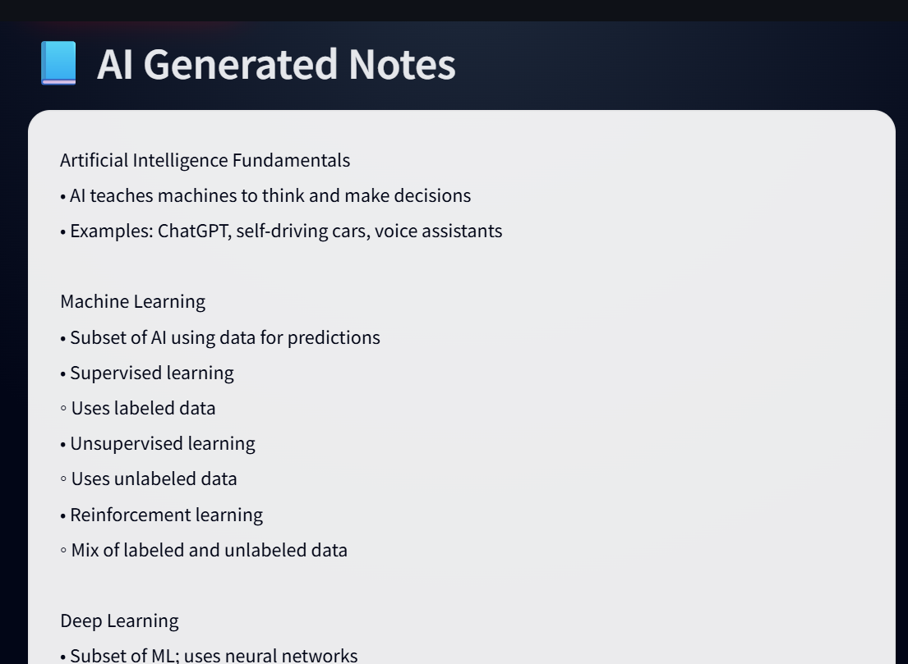
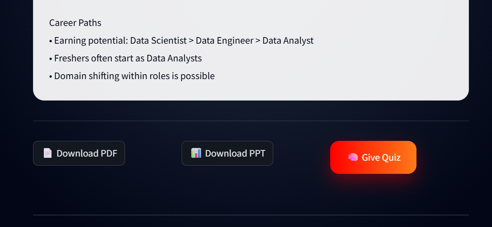
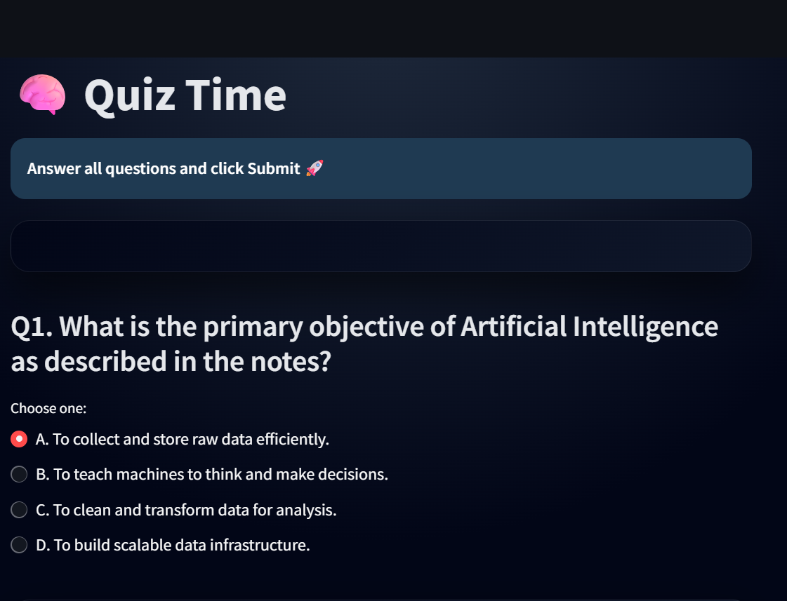
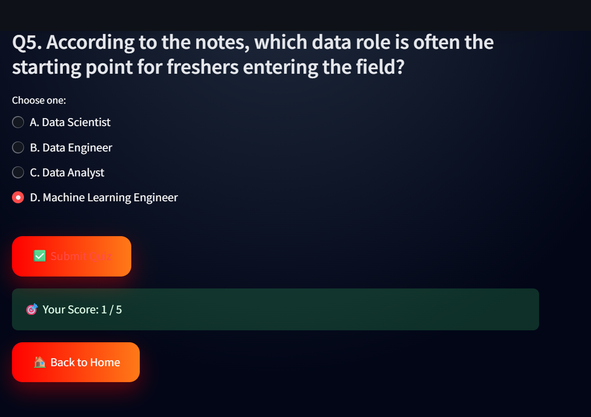

# 🎥 QuizTube AI  
**Turn YouTube Educational Videos into Smart Notes & Quizzes using AI**

---

## 📌 Project Overview

**NoteTube AI** is an AI-powered Streamlit web application that converts **educational YouTube videos** into **concise study notes**, **downloadable PDFs & PPTs**, and **interactive quizzes**.

The application automatically:
- Extracts YouTube video transcripts
- Filters **only study/educational videos**
- Generates structured notes using **Google Gemini AI**
- Creates MCQ-based quizzes for better learning

This project is ideal for **students, educators, and self-learners**.

---

## 🚀 Features

### ✅ Smart Transcript Extraction
- Supports `youtube.com` and `youtu.be` links
- Automatically selects English transcripts
- Falls back to available transcripts if English is unavailable

### ✅ Educational Video Validation
Only study-related videos are allowed using:
- Transcript availability check
- Minimum transcript length validation
- Educational keyword detection

❌ Music videos, shorts, reels, and vlogs are blocked

### ✅ AI-Powered Notes Generation
- Powered by **Google Gemini 2.5 Flash**
- Handles long videos using chunk-based processing
- Generates concise notes (within ~250 words)

### ✅ Downloadable Study Material
- 📄 **PDF** generated using `reportlab`
- 📊 **PowerPoint (PPT)** generated using `python-pptx`

### ✅ Interactive Quiz System
- Automatically generates **5 MCQs**
- Strict JSON validation
- Instant scoring and feedback

### ✅ Modern UI
- Built with Streamlit
- Custom CSS cards and gradients
- Session state management to prevent data loss

---

## 🛠️ Tech Stack

| Category | Technology |
|--------|-----------|
| Frontend | Streamlit |
| Backend | Python |
| AI Model | Google Gemini 2.5 Flash |
| Transcript API | YouTube Transcript API |
| PDF Generation | ReportLab |
| PPT Generation | python-pptx |
| Environment | python-dotenv |

---

---

## 📸 Screenshots

